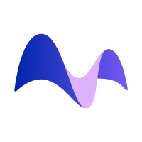
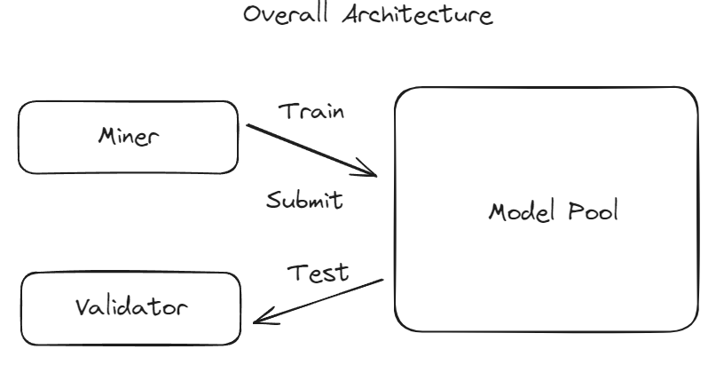
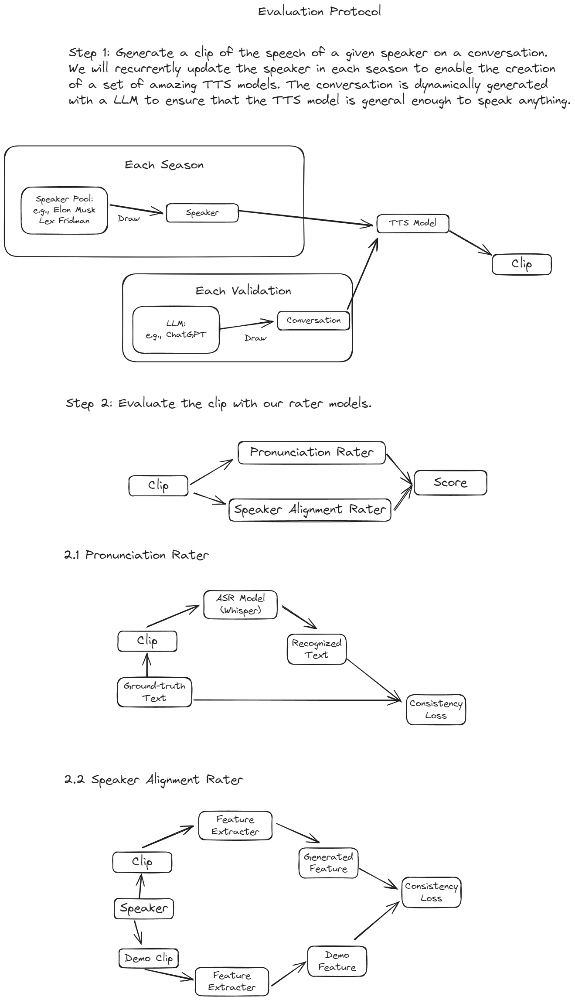

<div align="center">

<a href="https://myshell.ai/"></a><a href="https://bittensor.com/"></a>
<div  align="center"><h2>MyShell TTS Subnet</h2></div>
</div>

---
*News: We are now on the mainnet with uid 3! Please join the [Bittensor Discord](https://discord.gg/RXST8svz) and see us at Channel γ·gamma·3! Also, please check our [X (Twitter)](https://twitter.com/myshell_ai/status/1772792027148894557) for our vision of creating a collaborative environment where everyone can contribute, benefit, and engage with open-source models, ultimately empowering millions.  03/24*

## Introduction

> **Note:** The following documentation assumes you are familiar with basic Bittensor concepts: Miners, Validators, and incentives. If you need a primer, please check out https://docs.bittensor.com/learn/bittensor-building-blocks.

Text-to-Speech (TTS) models serve as the backbone for a wide range of applications, from virtual assistants to audiobooks. MyShell pioneers this field by open-sourcing the best TTS models, [OpenVoice](https://github.com/myshell-ai/OpenVoice) and [MeloTTS](https://github.com/myshell-ai/MeloTTS). We believe that open-source TTS models are essential for the future of AI and are committed to building a decentralized ecosystem to support their development.

Yet, the TTS landscape is still in its infancy. In this subnet, we aim to gather the wisdom of the whole open-source community to create the best *open-source* TTS models.

### Roadmap
As building a TTS model is a complex task, we will divide the development into several phases.

- **Phase 1**: Initial release of the subnet, including miner and validator functionality. This phase aim to build a comprehensive pipeline for TTS model training and evaluation. We will begin with a fixed speaker.
- **Phase 2**: Increase the coverage of speaker and conversation pool. We will recurrently update the speaker and language to cover more scenarios.
- **Phase 3**: More generally, we can have fast-clone models that can be adapted to new speakers with a small amount of data, e.g., [OpenVoice](https://github.com/myshell-ai/OpenVoice). We will move to fast-clone models in this phase.

## Current Status
We are currently in Phase 1. To start, we utilize the [VCTK](https://huggingface.co/datasets/vctk) dataset as the source of our speaker data. We randomly select 1 speaker from the dataset and the goal is to build a TTS model that can mimic this speaker's voice.

Please refer to `tts_rater` folder for audio samples from the speaker and the text used for evaluation.

## Overview

Our subnet operates as follows:

1. **Miners**: Train TTS model. Once a model is ready, the miner submits it to a Hugging Face 🤗 model pool, with metadata committed to the Bittensor chain.
2. **Validators**: Evaluate submitted models. Validators generate test cases and assess model performance, assigning weights based on results.
3. **Bittensor Blockchain**: Aggregates weights using Yuma Consensus to determine final weights and emissions for each miner.

### Evaluation Protocol
At the core of our subnet is the evaluation protocol. Unlike other modalities, TTS models are hard to evaluate with traditional metrics. We, therefore, propose a set of evaluation metrics that are more relevant to TTS models based on our experience:


## Getting Started
### Prerequisites
Please install this package first. We recommend using a virtual environment or conda environment.
```bash
git clone https://github.com/myshell-ai/MyShell-TTS-Subnet
cd MyShell-TTS-Subnet
pip install -e .
# The following command is required by the MeloTTS model
python -m unidic download
```
Please also install `ffmpeg` for audio processing.
```bash
# Ubuntu
sudo apt-get install ffmpeg
```

### Miners
See [Miner README](./docs/miner.md) for more details.
### Validators
See [Validator README](./docs/validator.md) for more details.

## Acknowledgement
Our codebase is built upon [Nous Research's Subnet](https://github.com/NousResearch/finetuning-subnet).

## License
This repository is licensed under the MIT License.
```text
# The MIT License (MIT)
# Copyright © 2023 Yuma Rao

# Permission is hereby granted, free of charge, to any person obtaining a copy of this software and associated
# documentation files (the “Software”), to deal in the Software without restriction, including without limitation
# the rights to use, copy, modify, merge, publish, distribute, sublicense, and/or sell copies of the Software,
# and to permit persons to whom the Software is furnished to do so, subject to the following conditions:

# The above copyright notice and this permission notice shall be included in all copies or substantial portions of
# the Software.

# THE SOFTWARE IS PROVIDED “AS IS”, WITHOUT WARRANTY OF ANY KIND, EXPRESS OR IMPLIED, INCLUDING BUT NOT LIMITED TO
# THE WARRANTIES OF MERCHANTABILITY, FITNESS FOR A PARTICULAR PURPOSE AND NONINFRINGEMENT. IN NO EVENT SHALL
# THE AUTHORS OR COPYRIGHT HOLDERS BE LIABLE FOR ANY CLAIM, DAMAGES OR OTHER LIABILITY, WHETHER IN AN ACTION
# OF CONTRACT, TORT OR OTHERWISE, ARISING FROM, OUT OF OR IN CONNECTION WITH THE SOFTWARE OR THE USE OR OTHER
# DEALINGS IN THE SOFTWARE.
```
